# File Upload Package Management - Complete Guide

## Overview

The package management system now supports npm-like file uploads where users can upload library files (`.tar.gz`, `.tgz`, `.zip`), which are automatically hashed with SHA-256 and the hash is stored on the blockchain for tamper detection.

---

## Architecture

```mermaid
graph LR
    User[User] -->|Upload File| API[API /packages/upload]
    API --> Hash[Calculate SHA-256]
    API --> Storage[Local File Storage]
    API --> Blockchain[Hyperledger Fabric]
    
    Blockchain --> Chain[Store Hash on Chain]
    Storage --> Disk[packages-storage/]
    
    style Blockchain fill:#2c3e50
    style Storage fill:#27ae60
```



---

## File Upload Workflow

### 1. Create a Package

```bash
# Create your library
mkdir my-library
cd my-library

# Add your code
echo "export function hello() { return 'Hello World'; }" > index.js
echo '{"name":"my-library","version":"1.0.0"}' > package.json

# Create tarball
tar -czf ../my-library-1.0.0.tar.gz .
cd ..
```

### 2. Upload to Backend

```bash
# Login first
TOKEN=$(curl -s -X POST http://localhost:3000/auth/login \
  -H "Content-Type: application/json" \
  -d '{"username":"owner","password":"Password123!"}' \
  | jq -r '.token')

# Upload package with file
curl -X POST http://localhost:3000/packages/upload \
  -H "Authorization: Bearer $TOKEN" \
  -F "file=@my-library-1.0.0.tar.gz" \
  -F "packageId=com.mycompany.library" \
  -F "version=1.0.0" \
  -F "name=My Library" \
  -F "description=A useful JavaScript library"
```

**Response:**
```json
{
  "message": "Package published successfully",
  "package": {
    "packageId": "com.mycompany.library",
    "version": "1.0.0",
    "name": "My Library",
    "fileHash": "a665a45920422f9d417e4867efdc4fb8a04a1f3fff1fa07e998e86f7f7a27ae3",
    "size": 2048,
    "downloadUrl": "/packages/com.mycompany.library/1.0.0/download-file"
  }
}
```

### 3. Download Package

```bash
curl -O http://localhost:3000/packages/com.mycompany.library/1.0.0/download-file
```

### 4. Validate Package Integrity

```bash
curl -X POST http://localhost:3000/packages/com.mycompany.library/1.0.0/validate-file \
  -F "file=@my-library-1.0.0.tar.gz"
```

**Response (Valid):**
```json
{
  "valid": true,
  "expectedHash": "a665a4592...",
  "actualHash": "a665a4592...",
  "message": "File integrity verified ✓"
}
```

**Response (Tampered):**
```json
{
  "valid": false,
  "expectedHash": "a665a4592...",
  "actualHash": "b776b5603...",
  "message": "File has been tampered with ✗"
}
```

---

## API Endpoints

### POST /packages/upload 📤

Upload and publish a new package version.

**Authentication:** Required (OWNER or ADMIN)

**Content-Type:** `multipart/form-data`

**Form Fields:**
| Field | Type | Required | Description |
|-------|------|----------|-------------|
| `file` | File | Yes | Package file (.tar.gz, .tgz, .zip) |
| `packageId` | String | Yes | Unique package identifier (lowercase, dots/dashes) |
| `version` | String | Yes | Semantic version (e.g., 1.0.0) |
| `name` | String | Yes | Human-readable package name |
| `description` | String | No | Package description |

**File Restrictions:**
- Accepted formats: `.tar.gz`, `.tgz`, `.zip`
- Max size: 100MB (configurable via `MAX_FILE_SIZE` in `.env`)

**What Happens:**
1. File is validated (type, size)
2. SHA-256 hash is calculated
3. File is saved to `packages-storage/packageId/version/`
4. Hash is published to blockchain
5. Subscribers are notified via email

---

### GET /packages/:packageId/:version/download-file 📥

Download the actual package file.

**Authentication:** Optional (downloads are tracked)

**Response:** File stream with headers:
- `Content-Type: application/gzip`  
- `Content-Disposition: attachment; filename="packageId-version.tar.gz"`

**Example:**
```bash
curl -O http://localhost:3000/packages/com.example.app/1.0.0/download-file
# Downloads: com.example.app-1.0.0.tar.gz
```

---

### POST /packages/:packageId/:version/validate-file ✅

Validate an uploaded file against the blockchain hash.

**Authentication:** None required

**Content-Type:** `multipart/form-data`

**Form Fields:**
| Field | Type | Required |
|-------|------|----------|
| `file` | File | Yes |

**What Happens:**
1. Hash of uploaded file is calculated
2. Expected hash is retrieved from blockchain
3. Hashes are compared
4. Result is returned

**Use Case:** Users can verify downloaded files haven't been tampered with.

---

### GET /packages/:packageId/:version

Get version details from blockchain.

**Enhanced Response:**
```json
{
  "packageId": "com.example.app",
  "version": "1.0.0",
  "fileHash": "a665a4592...",
  "status": "ACTIVE",
  "publisher": "Org1MSP",
  "downloadCount": 42,
  "fileAvailable": true,
  "downloadUrl": "/packages/com.example.app/1.0.0/download-file"
}
```

---

## File Storage Structure

```
packages-storage/
├── com.example.app/
│   ├── 1.0.0/
│   │   └── package.tar.gz
│   ├── 1.0.1/
│   │   └── package.tar.gz
│   └── 2.0.0/
│       └── package.tar.gz
├── com.another.library/
│   └── 1.0.0/
│       └── package.tar.gz
└── org.myorg.utils/
    └── 3.2.1/
        └── package.tar.gz
```

**Storage Location:** Configurable via `STORAGE_PATH` in `.env` (default: `./packages-storage`)

---

## Migrating to S3/Cloud Storage

The `FileStorageService` is designed to be easily migrated to S3 or other cloud storage.

### Example: AWS S3 Integration

```typescript
// src/services/FileStorageService.ts

import { S3Client, PutObjectCommand, GetObjectCommand } from '@aws-sdk/client-s3';

export class FileStorageService {
    private s3Client: S3Client;
    private bucketName: string;

    constructor() {
        this.s3Client = new S3Client({ region: process.env.AWS_REGION });
        this.bucketName = process.env.S3_BUCKET_NAME || 'my-package-storage';
    }

    async saveFile(packageId: string, version: string, fileBuffer: Buffer) {
        const key = `${packageId}/${version}/package.tar.gz`;
        const hash = this.calculateFileHash(fileBuffer);

        await this.s3Client.send(new PutObjectCommand({
            Bucket: this.bucketName,
            Key: key,
            Body: fileBuffer,
            ContentType: 'application/gzip',
            Metadata: { 'file-hash': hash }
        }));

        return { path: key, hash, size: fileBuffer.length };
    }

    async getFile(packageId: string, version: string): Promise<Buffer> {
        const key = `${packageId}/${version}/package.tar.gz`;
        const response = await this.s3Client.send(new GetObjectCommand({
            Bucket: this.bucketName,
            Key: key
        }));

        return Buffer.from(await response.Body!.transformToByteArray());
    }
}
```

---

## Security Features

### 1. Hash Validation

- **SHA-256 hashing** ensures file integrity
- Hash stored on **immutable blockchain**
- Validation endpoint allows users to verify files

### 2. File Type Validation

Only specific file types allowed:
- `.tar.gz`
- `.tgz`
- `.zip`

### 3. Size Limits

- Default: 100MB per file
- Configurable via `MAX_FILE_SIZE` in `.env`
- Prevents DOS attacks

### 4. Authentication

- Upload requires **OWNER** or **ADMIN** role
- Only package owner can publish new versions
- Downloads can be anonymous (for public packages)

### 5. Download Tracking

All downloads are logged with:
- Package ID and version
- User ID (if authenticated)
- IP address
- Timestamp

---

## Testing the Implementation

### Test 1: Upload a Package

```bash
# Create test package
echo "test content" > test.txt
tar -czf test-pkg.tar.gz test.txt

# Upload
curl -X POST http://localhost:3000/packages/upload \
  -H "Authorization: Bearer $TOKEN" \
  -F "file=@test-pkg.tar.gz" \
  -F "packageId=test.package" \
  -F "version=1.0.0" \
  -F "name=Test Package"
```

###  Test 2: Download and Verify

```bash
# Download
curl -O http://localhost:3000/packages/test.package/1.0.0/download-file

# Rename if needed
mv index.html test-pkg-downloaded.tar.gz

# Validate
curl -X POST http://localhost:3000/packages/test.package/1.0.0/validate-file \
  -F "file=@test-pkg-downloaded.tar.gz"
```

### Test 3: Tamper Detection

```bash
# Modify the file
echo "malicious code" >> test-pkg-downloaded.tar.gz

# Try to validate tampered file
curl -X POST http://localhost:3000/packages/test.package/1.0.0/validate-file \
  -F "file=@test-pkg-downloaded.tar.gz"

# Should return: "valid": false
```

### Test 4: Check Blockchain Record

```bash
curl http://localhost:3000/packages/test.package/1.0.0

# Response shows blockchain data:
# - fileHash (from ledger)
# - status (ACTIVE/DISCONTINUED)
# - publisher (MSP ID)
# - downloadCount
```

---

## Fabric Network Utility

Created [`src/utils/fabricNetwork.ts`](file:///Users/mac/Documents/cmu/fall-25/compiled/application-gateway-typescript/src/utils/fabricNetwork.ts) - a clean utility for all blockchain operations:

**Methods:**
- `connect()` - Initialize Fabric connection
- `publishRelease(packageId, version, fileHash)` - Publish to blockchain
- `getRelease(packageId, version)` - Get release details
- `validateRelease(packageId, version, fileHash)` - Validate hash
- `discontinueRelease(packageId, version)` - Mark as discontinued
- `disconnect()` - Clean shutdown

**Usage in routes:**
```typescript
import { fabricNetwork } from '../utils/fabricNetwork';

// Publish
await fabricNetwork.publishRelease(packageId, version, fileHash);

// Get details
const release = await fabricNetwork.getRelease(packageId, version);

// Validate
const valid = await fabricNetwork.validateRelease(packageId, version, hash);
```

---

## Monitoring Storage

Check storage statistics:

```typescript
import { fileStorage } from './services/FileStorageService';

const stats = await fileStorage.getStorageStats();
console.log(`Total packages: ${stats.totalPackages}`);
console.log(`Total size: ${(stats.totalSize / 1024 / 1024).toFixed(2)} MB`);
```

---

## Configuration

### Environment Variables

Add to `.env`:

```bash
# File Upload Configuration  
MAX_FILE_SIZE=104857600        # 100MB in bytes
STORAGE_PATH=./packages-storage
```

### Adjust Size Limits

For larger packages:
```bash
# 500MB limit
MAX_FILE_SIZE=524288000
```

For smaller packages:
```bash
# 10MB limit
MAX_FILE_SIZE=10485760
```

---

## Cleanup Operations

### Delete a Specific Version

```typescript
await fileStorage.deleteFile('com.example.app', '1.0.0');
```

### Delete Entire Package

```typescript
await fileStorage.deletePackage('com.example.app');
// Deletes all versions
```

### Admin Endpoint

```bash
# Discontinue package (deletes all files)
curl -X DELETE http://localhost:3000/packages/com.example.app \
  -H "Authorization: Bearer $ADMIN_TOKEN"
```

---

## Summary

✅ **File Upload** - Multipart form upload with multer  
✅ **Automatic Hashing** - SHA-256 calculated on upload  
✅ **Blockchain Storage** - Hash stored on Hyperledger Fabric  
✅ **File Download** - Stream files directly to users  
✅ **Tamper Detection** - Validate files against blockchain hash  
✅ **Local Storage** - Files stored in `packages-storage/`  
✅ **S3-Ready** - FileStorageService designed for easy cloud migration  
✅ **Fabric Utility** - Clean abstraction for all chaincode operations  
✅ **Download Tracking** - All downloads logged to database  
✅ **Email Notifications** - Subscribers notified on new uploads

**The system now works exactly like npm, but with blockchain-based integrity verification!** 🎉
