# GCP Deployment Guide - Package Management System

Complete guide to deploying your Hyperledger Fabric network and Node.js backend on Google Cloud Platform.

---

## Architecture Overview

```mermaid
graph TB
    Users[Users] --> LB[Load Balancer]
    LB --> Backend[Node.js Backend<br/>Compute Engine]
    Backend --> CloudSQL[(Cloud SQL<br/>PostgreSQL)]
    Backend --> GCS[Cloud Storage<br/>Package Files]
    Backend --> Fabric[Hyperledger Fabric<br/>Compute Engine VMs]
    
    Fabric --> Orderer[Orderer Nodes]
    Fabric --> Peer1[Peer Org1]
    Fabric --> Peer2[Peer Org2]
    
    style CloudSQL fill:#4285f4
    style GCS fill:#34a853
    style Fabric fill:#2c3e50
```



---

## Prerequisites

1. **GCP Account** with billing enabled
2. **gcloud CLI** installed: `gcloud init`
3. **Docker** installed locally
4. **Your code** committed to Git (GitHub/GitLab/Bitbucket)

---

## Step 1: Set Up GCP Project

```bash
# Set project variables
export PROJECT_ID="package-management-prod"
export REGION="us-central1"
export ZONE="us-central1-a"

# Create project
gcloud projects create $PROJECT_ID --name="Package Management"
gcloud config set project $PROJECT_ID

# Enable required APIs
gcloud services enable compute.googleapis.com
gcloud services enable sqladmin.googleapis.com
gcloud services enable storage.googleapis.com
gcloud services enable container.googleapis.com
gcloud services enable cloudresourcemanager.googleapis.com
```

---

## Step 2: Set Up Networking

```bash
# Create VPC network
gcloud compute networks create fabric-network \
    --subnet-mode=custom \
    --bgp-routing-mode=regional

# Create subnet
gcloud compute networks subnets create fabric-subnet \
    --network=fabric-network \
    --region=$REGION \
    --range=10.0.0.0/24

# Create firewall rules
gcloud compute firewall-rules create allow-fabric-internal \
    --network=fabric-network \
    --allow=tcp:7050-7054,tcp:8080,tcp:3000,tcp:5432 \
    --source-ranges=10.0.0.0/24

gcloud compute firewall-rules create allow-ssh \
    --network=fabric-network \
    --allow=tcp:22 \
    --source-ranges=0.0.0.0/0

gcloud compute firewall-rules create allow-https \
    --network=fabric-network \
    --allow=tcp:443,tcp:80 \
    --source-ranges=0.0.0.0/0
```

---

## Step 3: Deploy PostgreSQL Database

### Option A: Cloud SQL (Recommended)

```bash
# Create Cloud SQL instance
gcloud sql instances create package-db \
    --database-version=POSTGRES_16 \
    --tier=db-f1-micro \
    --region=$REGION \
    --network=fabric-network \
    --no-assign-ip

# Set root password
gcloud sql users set-password postgres \
    --instance=package-db \
    --password="STRONG_PASSWORD_HERE"

# Create database
gcloud sql databases create package_management \
    --instance=package-db

# Create application user
gcloud sql users create packageadmin \
    --instance=package-db \
    --password="APP_PASSWORD_HERE"

# Get connection name
gcloud sql instances describe package-db --format="value(connectionName)"
# Save this - you'll need it for the backend
```

### Option B: Self-Hosted PostgreSQL

```bash
# Create VM for PostgreSQL
gcloud compute instances create postgres-vm \
    --zone=$ZONE \
    --machine-type=e2-medium \
    --network-interface=subnet=fabric-subnet \
    --image-family=ubuntu-2004-lts \
    --image-project=ubuntu-os-cloud \
    --boot-disk-size=50GB \
    --tags=postgres

# SSH and install PostgreSQL
gcloud compute ssh postgres-vm --zone=$ZONE

# On the VM:
sudo apt update
sudo apt install -y postgresql postgresql-contrib
sudo -u postgres psql -c "CREATE DATABASE package_management;"
sudo -u postgres psql -c "CREATE USER packageadmin WITH PASSWORD 'password123';"
sudo -u postgres psql -c "GRANT ALL PRIVILEGES ON DATABASE package_management TO packageadmin;"

# Configure to accept remote connections
sudo nano /etc/postgresql/14/main/postgresql.conf
# Set: listen_addresses = '*'

sudo nano /etc/postgresql/14/main/pg_hba.conf
# Add: host all all 10.0.0.0/24 md5

sudo systemctl restart postgresql
```

---

## Step 4: Set Up Cloud Storage for Packages

```bash
# Create storage bucket
gsutil mb -p $PROJECT_ID -c STANDARD -l $REGION gs://package-storage-${PROJECT_ID}/

# Set lifecycle policy (optional - delete old versions after 90 days)
cat > lifecycle.json << EOF
{
  "lifecycle": {
    "rule": [
      {
        "action": {"type": "Delete"},
        "condition": {"age": 90}
      }
    ]
  }
}
EOF

gsutil lifecycle set lifecycle.json gs://package-storage-${PROJECT_ID}/

# Set CORS (if frontend will access directly)
cat > cors.json << EOF
[
  {
    "origin": ["https://yourdomain.com"],
    "method": ["GET"],
    "responseHeader": ["Content-Type"],
    "maxAgeSeconds": 3600
  }
]
EOF

gsutil cors set cors.json gs://package-storage-${PROJECT_ID}/
```

---

## Step 5: Deploy Hyperledger Fabric Network

### Create VMs for Fabric Nodes

```bash
# Orderer VM
gcloud comp instances create fabric-orderer \
    --zone=$ZONE \
    --machine-type=e2-standard-2 \
    --network-interface=subnet=fabric-subnet \
    --image-family=ubuntu-2004-lts \
    --image-project=ubuntu-os-cloud \
    --boot-disk-size=100GB \
    --tags=fabric-orderer

# Peer Org1
gcloud compute instances create fabric-peer0-org1 \
    --zone=$ZONE \
    --machine-type=e2-standard-2 \
    --network-interface=subnet=fabric-subnet \
    --image-family=ubuntu-2004-lts \
    --image-project=ubuntu-os-cloud \
    --boot-disk-size=100GB \
    --tags=fabric-peer

# Peer Org2 (if multi-org)
gcloud compute instances create fabric-peer0-org2 \
    --zone=$ZONE \
    --machine-type=e2-standard-2 \
    --network-interface=subnet=fabric-subnet \
    --image-family=ubuntu-2004-lts \
    --image-project=ubuntu-os-cloud \
    --boot-disk-size=100GB \
    --tags=fabric-peer
```

### Install Docker on Each VM

```bash
# SSH to each VM and run:
gcloud compute ssh fabric-orderer --zone=$ZONE

# Install Docker
curl -fsSL https://get.docker.com -o get-docker.sh
sudo sh get-docker.sh
sudo usermod -aG docker $USER

# Install Docker Compose
sudo curl -L "https://github.com/docker/compose/releases/download/v2.20.0/docker-compose-$(uname -s)-$(uname -m)" -o /usr/local/bin/docker-compose
sudo chmod +x /usr/local/bin/docker-compose

# Logout and login again for group changes to take effect
exit
```

### Deploy Fabric Network

```bash
# On each VM, clone your fabric network
git clone https://github.com/hyperledger/fabric-samples.git
cd fabric-samples/test-network

# Start the network
./network.sh up createChannel -c releasechannel -ca

# Deploy your chaincode
./network.sh deployCC -ccn SoftwareReleaseContract -ccp ../my-asset-chaincode-template -ccl java
```

**Note:** You'll need to modify the network configuration to use the internal IPs of your GCP VMs instead of `localhost`.

---

## Step 6: Deploy Node.js Backend

### Create Backend VM

```bash
gcloud compute instances create backend-server \
    --zone=$ZONE \
    --machine-type=e2-medium \
    --network-interface=subnet=fabric-subnet,no-address \
    --image-family=ubuntu-2004-lts \
    --image-project=ubuntu-os-cloud \
    --boot-disk-size=50GB \
    --tags=backend-server \
    --metadata=startup-script='#!/bin/bash
    curl -fsSL https://deb.nodesource.com/setup_20.x | sudo -E bash -
    sudo apt-get install -y nodejs git
    '
```

### Deploy Application

```bash
# SSH to backend server
gcloud compute ssh backend-server --zone=$ZONE

# Clone your repository
git clone https://github.com/yourusername/application-gateway-typescript.git
cd application-gateway-typescript

# Install dependencies
npm install

# Create .env file
cat > .env << 'EOF'
# Database (Cloud SQL)
DB_HOST=/cloudsql/YOUR_CONNECTION_NAME
DB_PORT=5432
DB_NAME=package_management
DB_USER=packageadmin
DB_PASSWORD=your_password

# JWT
JWT_SECRET=$(openssl rand -base64 32)
JWT_EXPIRES_IN=24h

# MFA
MFA_ISSUER=PackageManagement
MFA_APP_NAME=Package Management System

# Server
PORT=3000
NODE_ENV=production

# Fabric
CHANNEL_NAME=releasechannel
CHAINCODE_NAME=SoftwareReleaseContract
MSP_ID=Org1MSP
CRYPTO_PATH=/home/$USER/fabric-samples/test-network/organizations/peerOrganizations/org1.example.com
PEER_ENDPOINT=10.0.0.X:7051
PEER_HOST_ALIAS=peer0.org1.example.com

# Admin
ADMIN_MSP_IDS=Org1MSP

# Email
MAILTRAP_TOKEN=your_token
MAILTRAP_SENDER_EMAIL=noreply@yourdomain.com
MAILTRAP_SENDER_NAME=Package Management

# Storage
STORAGE_PATH=gs://package-storage-PROJECT_ID
MAX_FILE_SIZE=104857600
EOF

# Build
npm run build

# Install PM2 for process management
sudo npm install -g pm2

# Start the application
pm2 start dist/app.js --name package-backend
pm2 startup systemd
pm2 save
```

---

## Step 7: Update File Storage to Use Cloud Storage

Modify `src/services/FileStorageService.ts`:

```typescript
import { Storage } from '@google-cloud/storage';

export class FileStorageService {
    private storage: Storage;
    private bucketName: string;

    constructor() {
        this.storage = new Storage();
        this.bucketName = process.env.GCS_BUCKET || 'package-storage';
    }

    async saveFile(packageId: string, version: string, fileBuffer: Buffer) {
        const fileName = `${packageId}/${version}/package.tar.gz`;
        const file = this.storage.bucket(this.bucketName).file(fileName);
        
        const hash = this.calculateFileHash(fileBuffer);
        
        await file.save(fileBuffer, {
            metadata: {
                contentType: 'application/gzip',
                metadata: { hash }
            }
        });

        return { path: fileName, hash, size: fileBuffer.length };
    }

    async getFile(packageId: string, version: string): Promise<Buffer> {
        const fileName = `${packageId}/${version}/package.tar.gz`;
        const file = this.storage.bucket(this.bucketName).file(fileName);
        
        const [buffer] = await file.download();
        return buffer;
    }
}
```

Install dependency:
```bash
npm install @google-cloud/storage
```

---

## Step 8: Set Up Load Balancer & SSL

### Reserve Static IP

```bash
gcloud compute addresses create backend-ip --global
gcloud compute addresses describe backend-ip --global --format="value(address)"
```

### Create Instance Group

```bash
gcloud compute instance-groups unmanaged create backend-group \
    --zone=$ZONE

gcloud compute instance-groups unmanaged add-instances backend-group \
    --zone=$ZONE \
    --instances=backend-server
```

### Set Up Load Balancer

```bash
# Create health check
gcloud compute health-checks create http backend-health \
    --port=3000 \
    --request-path=/health

# Create backend service
gcloud compute backend-services create backend-service \
    --protocol=HTTP \
    --health-checks=backend-health \
    --global

gcloud compute backend-services add-backend backend-service \
    --instance-group=backend-group \
    --instance-group-zone=$ZONE \
    --global

# Create URL map
gcloud compute url-maps create backend-map \
    --default-service=backend-service

# Create SSL certificate (use your domain)
gcloud compute ssl-certificates create backend-cert \
    --domains=api.yourdomain.com

# Create HTTPS proxy
gcloud compute target-https-proxies create backend-https-proxy \
    --url-map=backend-map \
    --ssl-certificates=backend-cert

# Create forwarding rule
gcloud compute forwarding-rules create backend-https-rule \
    --address=backend-ip \
    --global \
    --target-https-proxy=backend-https-proxy \
    --ports=443
```

### Update DNS

Point your domain to the static IP:
```
A record: api.yourdomain.com → <STATIC_IP>
```

---

## Step 9: Run Database Migrations

```bash
# SSH to backend server
gcloud compute ssh backend-server --zone=$ZONE

# Install PostgreSQL client
sudo apt install -y postgresql-client

# If using Cloud SQL, install cloud-sql-proxy
wget https://dl.google.com/cloudsql/cloud_sql_proxy.linux.amd64 -O cloud_sql_proxy
chmod +x cloud_sql_proxy
./cloud_sql_proxy -instances=YOUR_CONNECTION_NAME=tcp:5432 &

# Run migrations
cd ~/application-gateway-typescript
for file in db/migrations/*.sql; do
    psql -h localhost -U packageadmin -d package_management -f "$file"
done

# Create admin user
psql -h localhost -U packageadmin -d package_management -c "
INSERT INTO users (username, email, password_hash, role) 
VALUES (
    'admin', 
    'admin@yourdomain.com', 
    '\$2b\$10\$HASH_HERE',  -- Generate with bcrypt
    'ADMIN'
);
"
```

---

## Step 10: Security Hardening

### Set Up IAM

```bash
# Create service account for backend
gcloud iam service-accounts create backend-sa \
    --display-name="Backend Service Account"

# Grant Cloud SQL client role
gcloud projects add-iam-policy-binding $PROJECT_ID \
    --member="serviceAccount:backend-sa@${PROJECT_ID}.iam.gserviceaccount.com" \
    --role="roles/cloudsql.client"

# Grant Storage admin role
gcloud projects add-iam-policy-binding $PROJECT_ID \
    --member="serviceAccount:backend-sa@${PROJECT_ID}.iam.gserviceaccount.com" \
    --role="roles/storage.objectAdmin"
```

### Enable Secret Manager

```bash
# Enable API
gcloud services enable secretmanager.googleapis.com

# Store secrets
echo -n "your-jwt-secret" | gcloud secrets create jwt-secret --data-file=-
echo -n "your-db-password" | gcloud secrets create db-password --data-file=-
echo -n "your-mailtrap-token" | gcloud secrets create mailtrap-token --data-file=-

# Grant access to service account
for secret in jwt-secret db-password mailtrap-token; do
    gcloud secrets add-iam-policy-binding $secret \
        --member="serviceAccount:backend-sa@${PROJECT_ID}.iam.gserviceaccount.com" \
        --role="roles/secretmanager.secretAccessor"
done
```

---

## Step 11: Monitoring & Logging

### Set Up Cloud Monitoring

```bash
# Install monitoring agent on VMs
curl -sSO https://dl.google.com/cloudagents/add-google-cloud-ops-agent-repo.sh
sudo bash add-google-cloud-ops-agent-repo.sh --also-install

# Configure application logging
# In your app.ts, add:
import { Logging } from '@google-cloud/logging';

const logging = new Logging();
const log = logging.log('package-backend');

// Log to Cloud Logging
log.write({
    resource: { type: 'global' },
    severity: 'INFO',
    message: 'Application started'
});
```

### Set Up Alerts

```bash
# Create uptime check
gcloud monitoring uptimechecks create https-check \
    --display-name="Backend Health Check" \
    --resource-type=uptime-url \
    --http-check-path=/health \
    --https-check-use-ssl \
    --monitored-resource=yourdomain.com
```

---

## Step 12: Backup Strategy

### Database Backups

```bash
# Enable automated backups for Cloud SQL
gcloud sql instances patch package-db \
    --backup-start-time=03:00

# Manual backup
gcloud sql backups create \
    --instance=package-db \
    --description="Pre-deployment backup"
```

### Storage Backups

```bash
# Enable versioning on bucket
gsutil versioning set on gs://package-storage-${PROJECT_ID}/

# Set up lifecycle policy for old versions
cat > backup-lifecycle.json << EOF
{
  "lifecycle": {
    "rule": [
      {
        "action": {"type": "Delete"},
        "condition": {
          "numNewerVersions": 3,
          "isLive": false
        }
      }
    ]
  }
}
EOF

gsutil lifecycle set backup-lifecycle.json gs://package-storage-${PROJECT_ID}/
```

---

## Cost Estimation

### Monthly Costs (Approximate)

| Service | Configuration | Est. Cost/Month |
|---------|--------------|-----------------|
| Compute Engine (Backend) | e2-medium | ~$25 |
| Compute Engine (Fabric x3) | e2-standard-2 x3 | ~$150 |
| Cloud SQL | db-f1-micro | ~$10 |
| Cloud Storage | 100GB | ~$2 |
| Load Balancer | HTTP(S) | ~$20 |
| **Total** | | **~$207/month** |

### Cost Optimization Tips

1. **Use Preemptible VMs** for dev/test environments (70% cheaper)
2. **Committed Use Discounts** - 57% discount for 3-year commitment
3. **Auto-scaling** - Scale down during low traffic
4. **Right-size instances** - Start small, scale up as needed

---

## Deployment Checklist

- [ ] GCP project created and configured
- [ ] VPC network and firewall rules set up
- [ ] Cloud SQL PostgreSQL instance created
- [ ] Cloud Storage bucket created
- [ ] Fabric network VMs deployed
- [ ] Docker installed on all VMs
- [ ] Hyperledger Fabric network running
- [ ] Chaincode deployed
- [ ] Backend VM created
- [ ] Application code deployed
- [ ] Environment variables configured
- [ ] Database migrations run
- [ ] PM2 process manager configured
- [ ] Load balancer configured
- [ ] SSL certificate installed
- [ ] DNS records updated
- [ ] IAM and service accounts configured
- [ ] Secrets stored in Secret Manager
- [ ] Monitoring and logging enabled
- [ ] Backup strategy implemented
- [ ] Security hardening completed

---

## Testing the Deployment

```bash
# Test health endpoint
curl https://api.yourdomain.com/health

# Test authentication
curl -X POST https://api.yourdomain.com/auth/login \
  -H "Content-Type: application/json" \
  -d '{"username":"admin","password":"password"}'

# Test package upload
curl -X POST https://api.yourdomain.com/packages/upload \
  -H "Authorization: Bearer <token>" \
  -F "file=@test.tar.gz" \
  -F "packageId=test.pkg" \
  -F "version=1.0.0" \
  -F "name=Test Package"
```

---

## Maintenance

### Update Application

```bash
# SSH to backend
gcloud compute ssh backend-server --zone=$ZONE

cd ~/application-gateway-typescript
git pull
npm install
npm run build
pm2 restart package-backend
```

### Scale Up

```bash
# Add more backend instances
gcloud compute instance-groups managed resize backend-group \
    --size=3 \
    --zone=$ZONE
```

### View Logs

```bash
# Application logs
pm2 logs package-backend

# System logs
sudo journalctl -u pm2-$USER

# Cloud logs
gcloud logging read "resource.type=gce_instance" --limit 50
```

---

## Troubleshooting

### Common Issues

**Issue: Can't connect to Fabric**
```bash
# Check Fabric peers are running
docker ps
docker logs peer0.org1.example.com

# Verify network connectivity
ping <peer-internal-ip>
telnet <peer-ip> 7051
```

**Issue: Database connection failed**
```bash
# Test Cloud SQL connection
gcloud sql connect package-db --user=packageadmin

# Check firewall
gcloud compute firewall-rules list
```

**Issue: File upload fails**
```bash
# Check Cloud Storage permissions
gsutil iam get gs://package-storage-${PROJECT_ID}/

# Test bucket access
gsutil ls gs://package-storage-${PROJECT_ID}/
```

---

## Next Steps

1. **Set up CI/CD** - Use Cloud Build for automated deployments
2. **Add CDN** - Use Cloud CDN for package downloads
3. **Multi-region** - Deploy to multiple regions for HA
4. **Kubernetes** - Consider GKE for easier scaling
5. **Managed Blockchain** - Explore Google Cloud's managed blockchain solutions

---

## Summary

You now have a production-ready deployment on GCP with:
- ✅ Hyperledger Fabric network on Compute Engine
- ✅ Node.js backend with PM2
- ✅ PostgreSQL on Cloud SQL
- ✅ Package storage on Cloud Storage
- ✅ HTTPS load balancer with SSL
- ✅ Monitoring and logging
- ✅ Automated backups
- ✅ Security hardening

**Your API is now live at:** `https://api.yourdomain.com` 🎉
